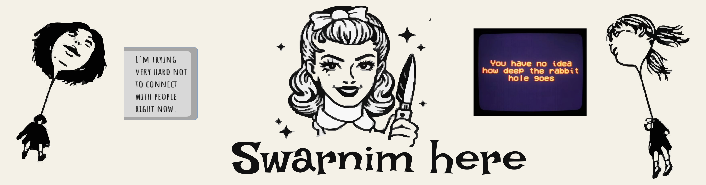

<h1 align="center">'Sup</h1>

**<h3 align="center">`I'm an engineer in making to do something innovative and creative`</h3>**

- 🔭i’m currently learning **Haskell with the intention of making something with it**
  
- 🌱 recently working on **Animal detection through satellite images**

- 📫 feel free to reach me at my mail - **swarnim3103@gmail.com**

- ⚡ Fun fact about me : i would direct the next biggest horror movie i just need a storyline

<h2>Everything about my tech in a shell</h2>

 

  <a href="https://github.com/swarnim3103">
      
  <a href="https://github.com/swarnim3103">
    

### Have a nice and peaceful day ahead ✨ 

